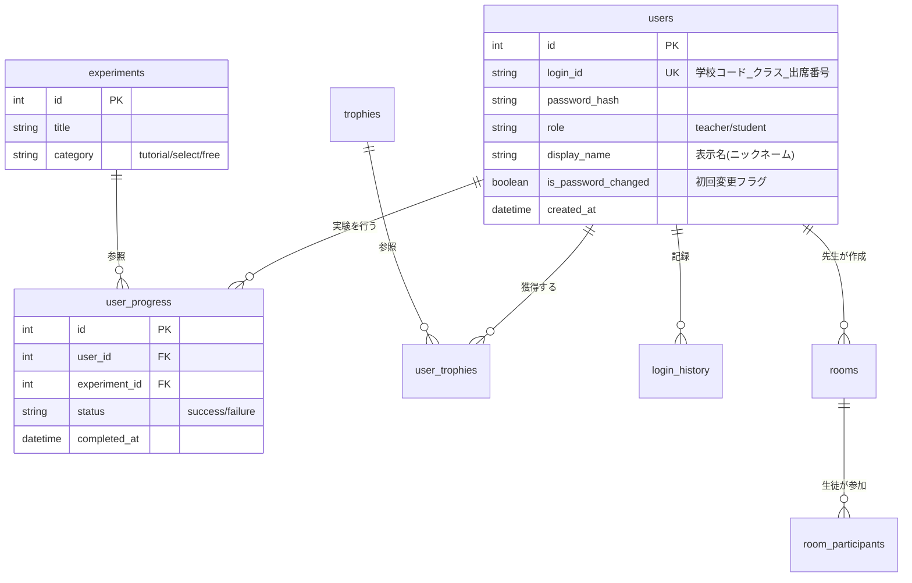

# VCL データベース設計書

## 1. 概要
本プロジェクトではデータベースに **SQLite** を採用します。
アプリケーションの規模（小中学生向け、スタンドアロンに近い運用とクラス単位のリアルタイム同期）を考慮し、軽量かつバックアップが容易な構成とします。

---

## 2. ER図 (概念モデル)



---

## 3. テーブル定義

### 3.1 ユーザー管理 (users)
生徒および教師のアカウント情報を管理するテーブルです。

| カラム名 | データ型 | 制約 | 説明 |
| :--- | :--- | :--- | :--- |
| `id` | INTEGER | PK, AUTOINCREMENT | 内部識別ID |
| `login_id` | TEXT | UNIQUE, NOT NULL | ログインID (例: `SCH01_1A_05`) |
| `password_hash` | TEXT | NOT NULL | ハッシュ化されたパスワード |
| `role` | TEXT | NOT NULL | `student` (生徒) または `teacher` (教師) |
| `display_name` | TEXT | NULLABLE | 画面表示名 (ニックネーム) |
| `is_password_changed` | INTEGER | DEFAULT 0 | 0:未変更(初回), 1:変更済み |
| `note` | TEXT | NULLABLE | 教師用メモ (氏名・連絡先等) |
| `created_at` | DATETIME | DEFAULT CURRENT_TIMESTAMP | 作成日時 |
| `updated_at` | DATETIME | DEFAULT CURRENT_TIMESTAMP | 更新日時 |

### 3.2 実験マスタ (experiments)
システムで実施可能な実験リストを管理するマスタテーブルです。

| カラム名 | データ型 | 制約 | 説明 |
| :--- | :--- | :--- | :--- |
| `id` | INTEGER | PK, AUTOINCREMENT | 実験ID |
| `title` | TEXT | NOT NULL | 実験名 (例: 酸素の発生実験) |
| `category` | TEXT | NOT NULL | `tutorial`, `select`, `free` |
| `description` | TEXT | | 実験の概要・説明 |

### 3.3 実験進捗・履歴 (user_progress)
ユーザーがどの実験を成功/失敗したかを記録します。

| カラム名 | データ型 | 制約 | 説明 |
| :--- | :--- | :--- | :--- |
| `id` | INTEGER | PK, AUTOINCREMENT | 履歴ID |
| `user_id` | INTEGER | FK (users.id) | 実施したユーザー |
| `experiment_id` | INTEGER | FK (experiments.id) | 実験の種類 |
| `status` | TEXT | NOT NULL | `success` (成功), `failure` (失敗) |
| `played_at` | DATETIME | DEFAULT CURRENT_TIMESTAMP | 実施日時 |

### 3.4 トロフィーマスタ (trophies)
獲得可能なトロフィーの定義情報です。

| カラム名 | データ型 | 制約 | 説明 |
| :--- | :--- | :--- | :--- |
| `id` | INTEGER | PK, AUTOINCREMENT | トロフィーID |
| `title` | TEXT | NOT NULL | トロフィー名 |
| `description` | TEXT | NOT NULL | 獲得条件の説明 |
| `condition_code` | TEXT | NOT NULL | プログラム判定用コード |
| `icon_path` | TEXT | | アイコン画像のパス |

### 3.5 獲得トロフィー (user_trophies)
ユーザーが実際に獲得したトロフィーを紐付けます。

| カラム名 | データ型 | 制約 | 説明 |
| :--- | :--- | :--- | :--- |
| `id` | INTEGER | PK, AUTOINCREMENT | ID |
| `user_id` | INTEGER | FK (users.id) | ユーザー |
| `trophy_id` | INTEGER | FK (trophies.id) | 獲得したトロフィー |
| `acquired_at` | DATETIME | DEFAULT CURRENT_TIMESTAMP | 獲得日時 |

### 3.6 ログイン履歴 (login_history)
要件「3.5 ログアウトの日時を登録」に対応するための監査ログテーブルです。

| カラム名 | データ型 | 制約 | 説明 |
| :--- | :--- | :--- | :--- |
| `id` | INTEGER | PK, AUTOINCREMENT | ログID |
| `user_id` | INTEGER | FK (users.id) | 対象ユーザー |
| `action` | TEXT | NOT NULL | `login` または `logout` |
| `timestamp` | DATETIME | DEFAULT CURRENT_TIMESTAMP | 操作日時 |

### 3.7 クラスルーム (rooms) - アクティビティモード用
教師が作成する一時的な部屋情報の管理。

| カラム名 | データ型 | 制約 | 説明 |
| :--- | :--- | :--- | :--- |
| `id` | INTEGER | PK, AUTOINCREMENT | 内部ID |
| `room_code` | TEXT | UNIQUE, NOT NULL | 参加用4桁パスコード |
| `host_id` | INTEGER | FK (users.id) | 作成した教師 |
| `status` | TEXT | DEFAULT 'active' | `waiting`, `active`, `closed` |
| `created_at` | DATETIME | DEFAULT CURRENT_TIMESTAMP | 作成日時 |

---

## 4. 初期化SQL (実行用)

```sql
-- ユーザーテーブル
CREATE TABLE IF NOT EXISTS users (
  id INTEGER PRIMARY KEY AUTOINCREMENT,
  login_id TEXT UNIQUE NOT NULL,
  password_hash TEXT NOT NULL,
  role TEXT NOT NULL CHECK (role IN ('student', 'teacher', 'admin')),
  display_name TEXT,
  is_password_changed INTEGER DEFAULT 0 CHECK (is_password_changed IN (0, 1)),
  note TEXT,
  created_at DATETIME DEFAULT CURRENT_TIMESTAMP,
  updated_at DATETIME DEFAULT CURRENT_TIMESTAMP
);

-- 実験マスタ
CREATE TABLE IF NOT EXISTS experiments (
  id INTEGER PRIMARY KEY AUTOINCREMENT,
  title TEXT NOT NULL,
  category TEXT NOT NULL,
  description TEXT
);

-- 実験履歴
CREATE TABLE IF NOT EXISTS user_progress (
  id INTEGER PRIMARY KEY AUTOINCREMENT,
  user_id INTEGER NOT NULL,
  experiment_id INTEGER NOT NULL,
  status TEXT NOT NULL,
  played_at DATETIME DEFAULT CURRENT_TIMESTAMP,
  FOREIGN KEY (user_id) REFERENCES users(id),
  FOREIGN KEY (experiment_id) REFERENCES experiments(id)
);

-- トロフィーマスタ
CREATE TABLE IF NOT EXISTS trophies (
  id INTEGER PRIMARY KEY AUTOINCREMENT,
  title TEXT NOT NULL,
  description TEXT NOT NULL,
  condition_code TEXT NOT NULL,
  icon_path TEXT
);

-- トロフィー獲得状況
CREATE TABLE IF NOT EXISTS user_trophies (
  id INTEGER PRIMARY KEY AUTOINCREMENT,
  user_id INTEGER NOT NULL,
  trophy_id INTEGER NOT NULL,
  acquired_at DATETIME DEFAULT CURRENT_TIMESTAMP,
  FOREIGN KEY (user_id) REFERENCES users(id),
  FOREIGN KEY (trophy_id) REFERENCES trophies(id),
  UNIQUE(user_id, trophy_id)
);

-- ログイン履歴
CREATE TABLE IF NOT EXISTS login_history (
  id INTEGER PRIMARY KEY AUTOINCREMENT,
  user_id INTEGER NOT NULL,
  action TEXT NOT NULL CHECK (action IN ('login', 'logout')),
  timestamp DATETIME DEFAULT CURRENT_TIMESTAMP,
  FOREIGN KEY (user_id) REFERENCES users(id)
);

-- アクティビティルーム
CREATE TABLE IF NOT EXISTS rooms (
  id INTEGER PRIMARY KEY AUTOINCREMENT,
  room_code TEXT UNIQUE NOT NULL,
  host_id INTEGER NOT NULL,
  status TEXT DEFAULT 'waiting',
  created_at DATETIME DEFAULT CURRENT_TIMESTAMP,
  FOREIGN KEY (host_id) REFERENCES users(id)
);
```
